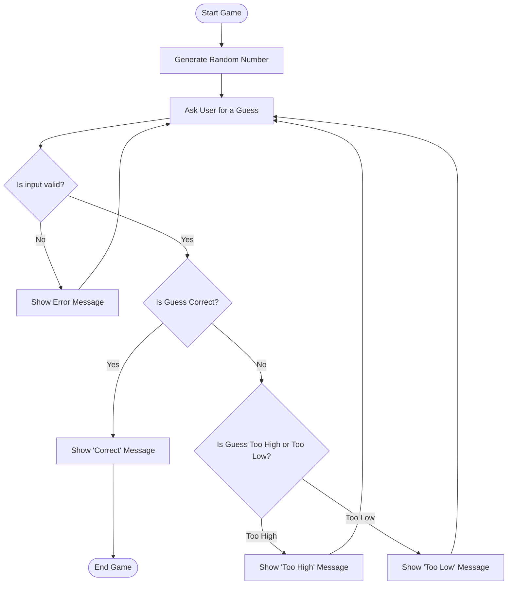

This flowchart describes a number-guessing game. First, it generates a random number. After generating the random number, it will ask the user to guess the number. Then, it validates the input-if the number is invalid, it shows an error message. If it is valid, it checks whether the number is correct; if yes, it prints a successful message and then goes to the end of the game. If not, it lets the user know if it was too big or too small. Then, it asks the user to guess the number once more.
